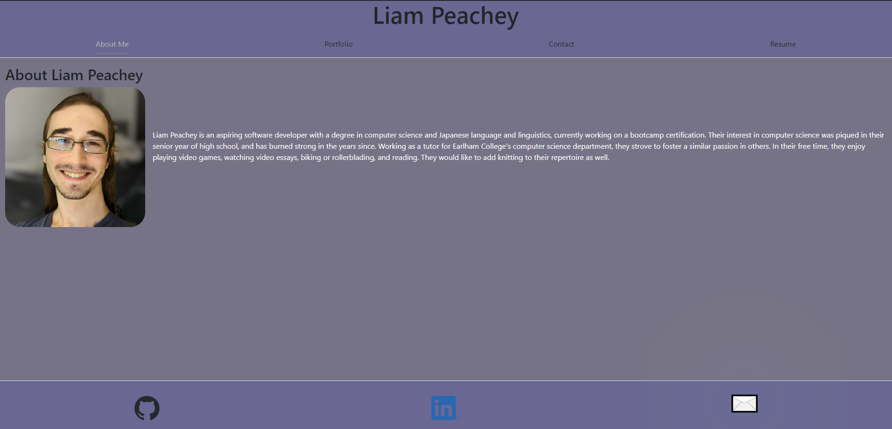

# Portfolio-Using-React
A portfolio website that organizes my projects for reference, to present to employers, and to utilize and practice React and client + server structures

## Description

A portfolio website that organizes my projects for reference, to present to employers, and to practice HTML and CSS. 

## Product

The deployed website can be found [here](https://liam-peachey-portfolio.netlify.app/).

## Project Preview

